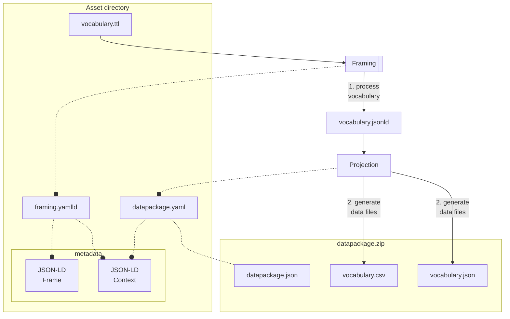
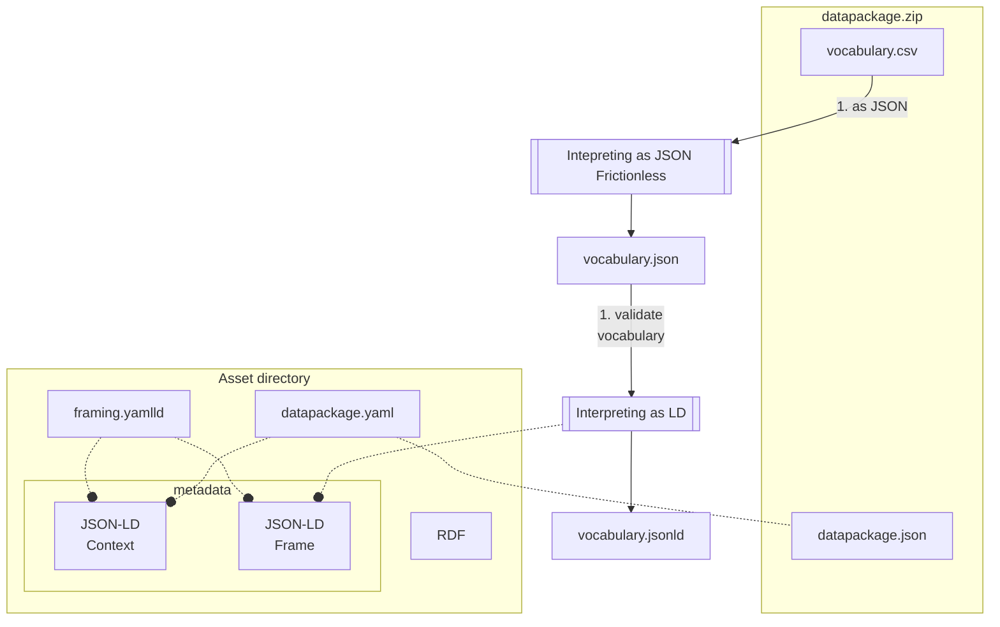

# Using datapackage.json

Hi, if you are reading this, you are probably interested in using datapackage.json to access resources.

This is an experiment in using datapackage.json to provide metadata and semantics to existing CSV files that are produced
according to an original RDF source.

This applies for example to every CSV file whose data can be mapped to RDF, such as education-level.csv

```csv
codice_1_livello,label_ITA_1_livello,label_ENG_1_livello,definizione
NED,Nessun titolo di studio ,No educational degree,Non è stato conseguito alcun titolo di studio
```

has been extracted from the original RDF source without specific fields aggregation / composition:

```turtle
@prefix edu: <https://w3id.org/italia/controlled-vocabulary/classifications-for-people/education-level/> .
@prefix skos: <http://www.w3.org/2004/02/skos/core#> .

edu:NED a edu:EducationLevel ;
    skos:prefLabel  "No educational degree"@en,
                    "Nessun titolo di studio"@it ;
    skos:definition "Non è stato conseguito alcun titolo di studio" .
```

## Opening a datapackage

This example uses frictionless-py to access data packages,
but you can use any other  compliant library.

```python
from frictionless import Package

package = Package("datapackage.json")
package.validate()
for i, resource in enumerate(package.resources):
    print(f"Resource n. {i}: {resource.name} in file {resource.path}")
    resource.validate()

```

As you can see, resource extraction is completely transparent
and the processed data can be accessed as keyed dictionaries or list of items.

```python
from frictionless.plugins.csv import CsvDialect
from frictionless.plugins.json import JsonDialect

resource = package.resources[0]
data = resource.read_rows()
resource.write(
    "vocabulary-copy.csv",
    dialect=CsvDialect(delimiter=","),
)
resource.write(
    "vocabulary-copy.json",
    dialect=JsonDialect( keyed=True ),
)
```

## Semantic information

Using an extension keyword like [x-jsonld-context](https://www.ietf.org/archive/id/draft-polli-restapi-ld-keywords-00.html#name-the-x-jsonld-context-json-s)
it is possible to provide a JSON-LD context that can be used
to interpred the JSON objects contained in a resource as Linked Data
according to [JSON-LD specs](https://www.w3.org/TR/json-ld11/#interpreting-json-as-json-ld).

```yaml
"@context":
    "@vocab": "https://w3id.org/italia/controlled-vocabulary/classifications-for-people/education-level/"
    "@base": "https://w3id.org/italia/controlled-vocabulary/classifications-for-people/education-level/"
    "skos": "http://www.w3.org/2004/02/skos/core#"
    "codice_1_livello": { "@id": "@id", "@type": "@id" }
    "label_ITA_1_livello": { "@id": "skos:prefLabel", "@language": "en" }
    "label_ENG_1_livello": { "@id": "skos:prefLabel", "@language": "it" }
    "definizione": { "@id": "skos:definition", "@language": "it" }
codice_1_livello: ITA
label_ITA_1_livello: "Nessun titolo di studio"
label_ENG_1_livello: "No educational degree"
definizione: "Non è stato conseguito alcun titolo di studio"
```

This kind of format can be used to either process CSV data
as JSON-LD, or to provide the vocabulary through REST API
without losing the semantic information originally provided
in the RDF source.


# Extraction data process



# Publishing process


